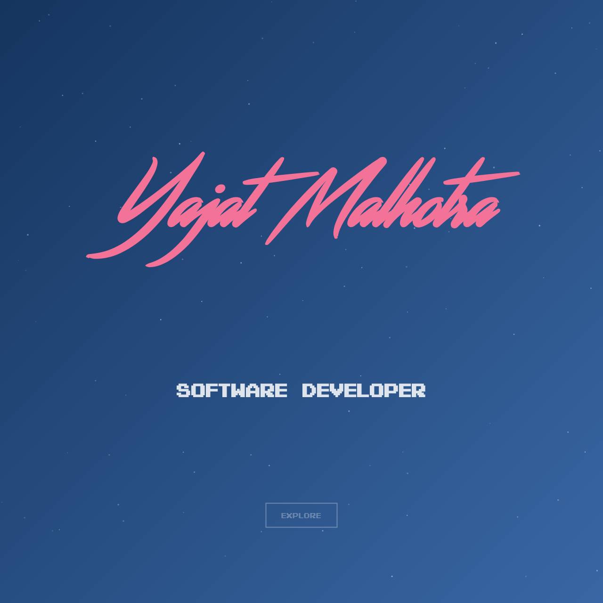
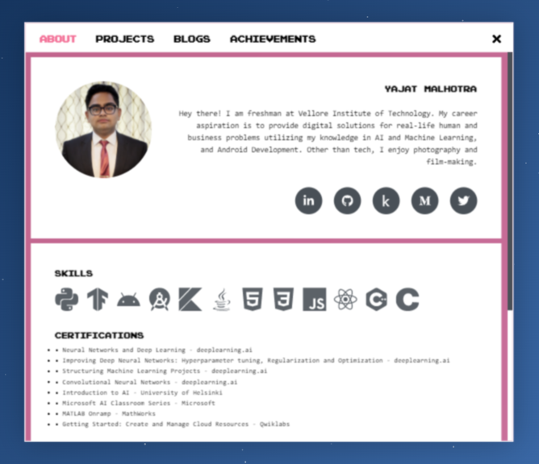
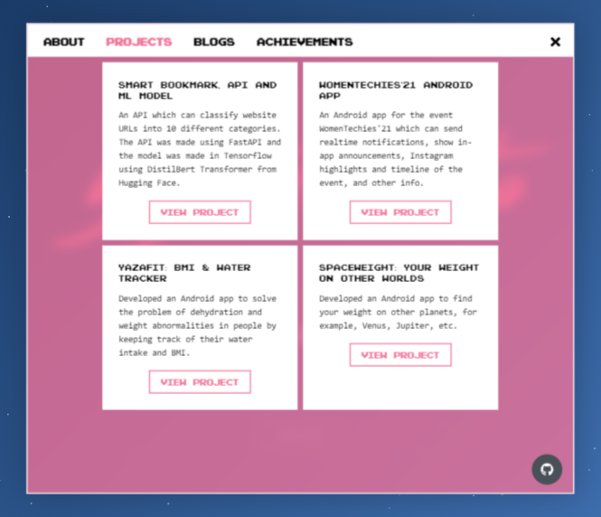
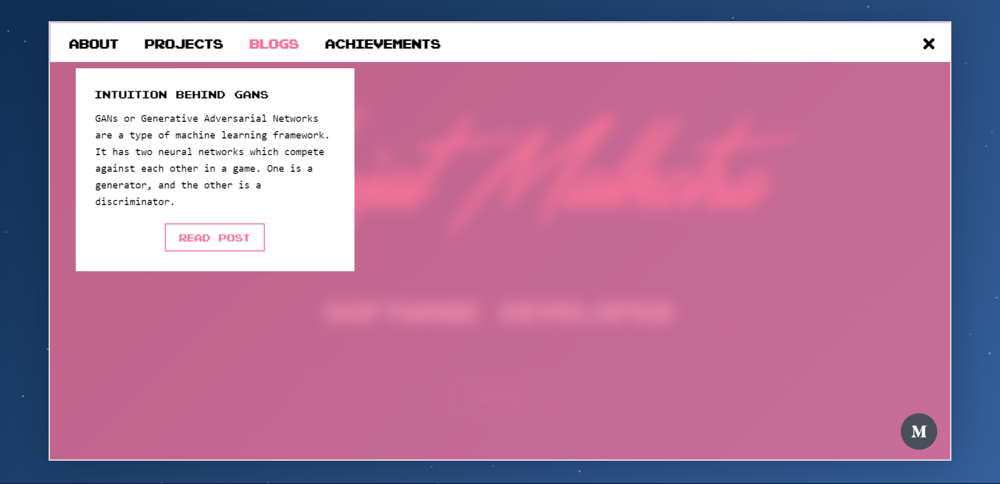
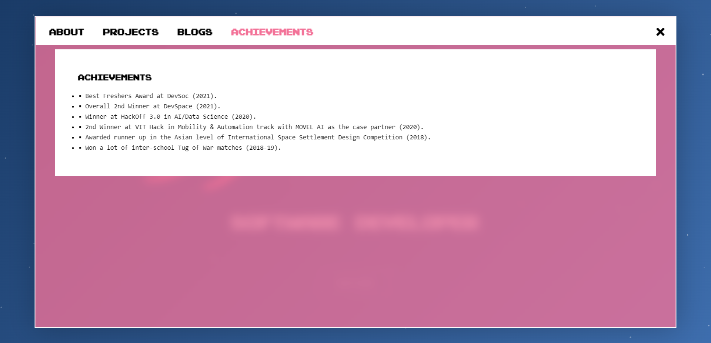

# Retro Portfolio

### Screenshots

[Demo link](https://retro-portfolio.pages.dev/)

### Before Running
Have the following installed on your computer:

- [Git](https://git-scm.com/downloads)
- [Node.js](https://nodejs.org/)
- [npm](https://docs.npmjs.com/downloading-and-installing-node-js-and-npm)

### Cloning the project
Using your terminal, run the following command in the directory where you want the project:

- SSH: `git@github.com:iamyajat/retro-portfolio-website.git`
- HTTP: `https://github.com/iamyajat/retro-portfolio-website.git`

### Running the Project
First, install the depedencies in the project! In a terminal, make sure you are in the directory of the project and run (depending on your package manager):

| npm | yarn |
| ----------- | ----------- |
| `npm install` | `yarn` |

Next, simply run the project with the following command in your terminal (depending on your package manager):

| npm | yarn |
| ----------- | ----------- |
| `npm start` | `yarn start` |

This will run the project at  [http://localhost:3000](http://localhost:3000). To close the project at any time, press `CTRL+C` in your terminal.